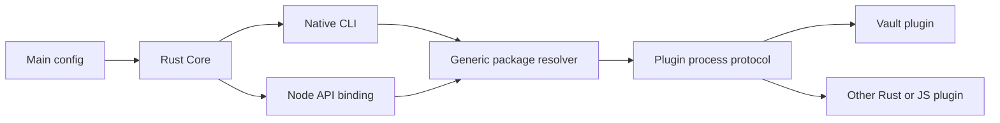

# Architecture

`env-lane-core` owns workspace discovery, dotenv parsing and resolution, policies, sorting, and the canonical main config. `env-lane-cli` owns only Core command presentation and generic plugin routing. `env-lane-plugin-api` owns package metadata, capability declarations, the JSON-RPC codec, and process lifecycle. `env-lane-plugin-vault` owns the Vault command grammar and native API; `env-lane-vault` owns Vault config, crypto, records, restore, and sync. `env-lane-node` exposes Core operations and registered plugin namespaces to Node.

The main config reserves `selector`, `workspace`, `dotenv`, `output`, `sort`, `checks`, and `sync`. Every other root field must be a valid plugin registration. The only built-in registration table entry is Vault, which provides its package name and default config file. Package metadata supplies command names, native API namespaces, executable entry, and capabilities. The host never parses plugin-specific options or assumes an unknown native operation belongs to Vault.

Native declarative config and Core commands need no Node. A native plugin also needs no Node. JS/TS config evaluation uses the optional `@env-lane/config-compat` runner and stores a source-origin envelope; Rust validates the raw config and checks source hashes. A JS plugin uses Node at plugin startup and `@env-lane/plugin-sdk` handles the process protocol. Stable Node package imports use the `@env-lane/native` binding and keep their asynchronous diagnostic and callback adapters.

Vault persistence is separate from public API compatibility: v0/v1 record reads, legacy sync-state migration, redaction, transaction locking, and digest-bound restore plans remain. The deprecated 0.4.x root exports and JS Commander executable are gone. `@env-lane/vault/cli` remains because it is a stable embedding entry.
